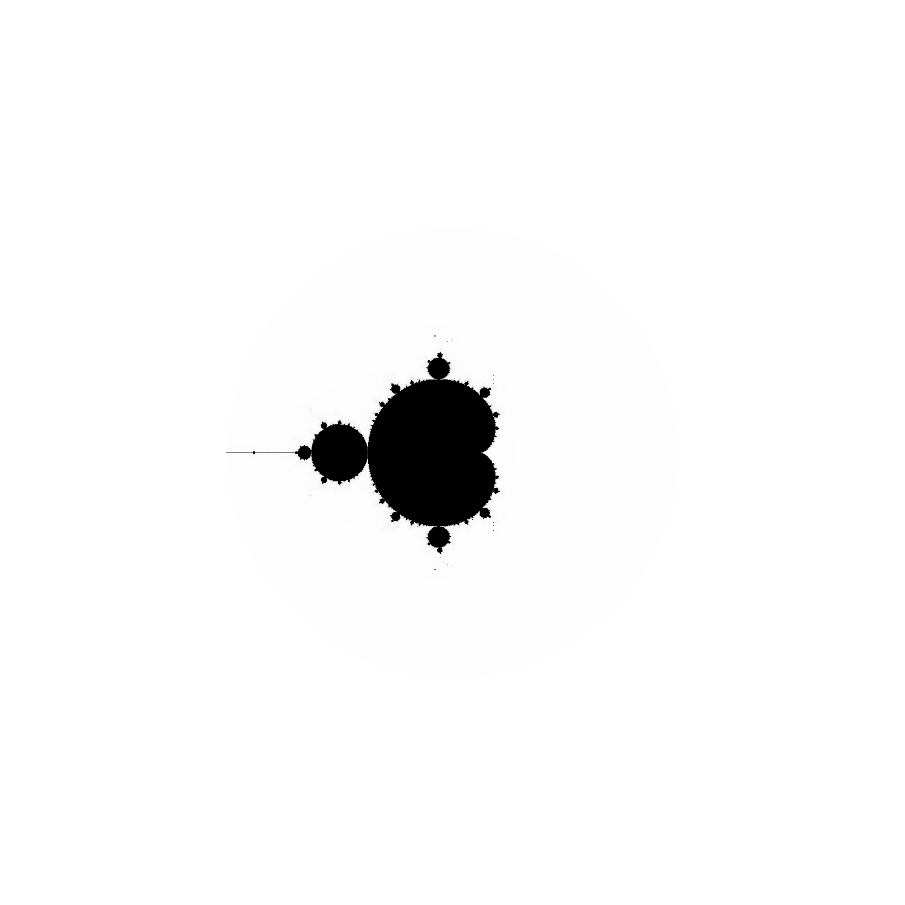
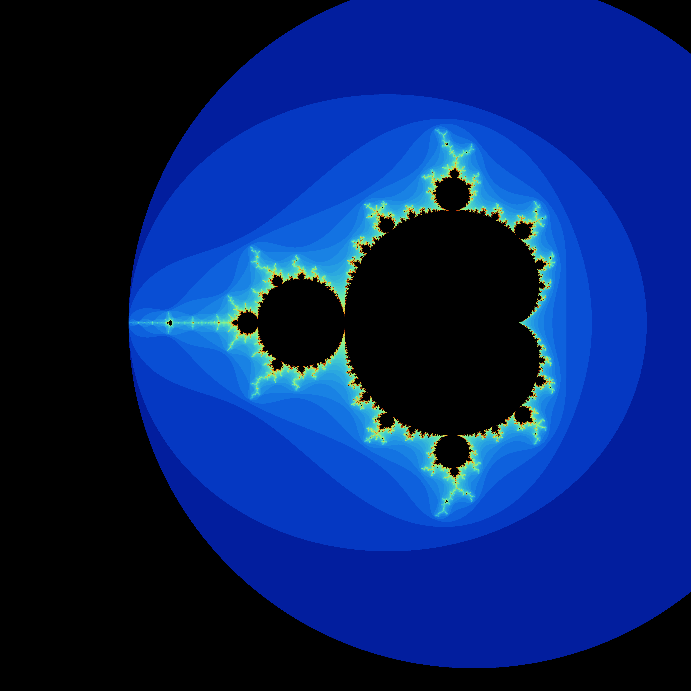

<!-- # Parallelized Mandelbrot Set Generator with OpenMP
### Introduction
A Mandlebrot set is defined to be the set of all complex numbers $\{c\}$ for which the generator function:

$f_c(z) = z^2 + c$

Stays bounded (i.e. does not diverege to $\pm \infty$). We start with a value of $z=0$ and iteratively evaluate $f_c$ as follows:

$[f_c(0), f_c(f_c(0)), f_c(f_c(f_c(0))),\dots]$

### Defining Divergence
Traditionally, divergence is defined by a threshold of the magnitude of the current element in the sequence. For example, if we choose a threshold of $f_{max} = 10$, then the sequence diverges at the $i^{th}$ iteration if $|f_c(i)| > f_{max} = 10$.

### Methods
Approach A: Fine-grained parallelization of Mandelbrot generator

Approach B: Generate multiple frames of generator at different "zooms" to create movie, assign different threads for different frames


Generated figure:
 -->

# Parallelized Mandelbrot Set Generator with OpenMP




## Introduction

A Mandelbrot set is defined as the set of all complex numbers  $\{c\}$ for which the generator function:

$f_c(z) = z^2 + c$

remains bounded (i.e., does not diverge to $\pm \infty$). We start with $z=0$ and iteratively evaluate $f_c$ as follows:

$[f_c(0), f_c(f_c(0)), f_c(f_c(f_c(0))),\dots]$

## Defining Divergence

Traditionally, divergence is defined by a threshold of the magnitude of the current element in the sequence. For example, if we choose a threshold of $f_{max} = 10$, then the sequence diverges at the $i^{th}$ iteration if $|f_c(i)| > f_{max} = 10$.

## Methods

### Approach A: Fine-Grained Parallelization

- Pixel-level parallelization, each thread evolves the Mandelbrot set for differnt starting values $c$ in the complex plane.
- Poor scaling due to critical access of shared data buffer.

### Approach B: Parallel Frame Generation for Zoom Animation

- Frame-by-frame parallelization when generating multiple frames of the Mandelbrot set at different scales to create a movie (i.e. zooming into one point of the plane).
- Each frame is assigned to a different thread for parallel processing.
- The generated frames are then compiled into a video.
- Much more efficient scaling, each thread works on independent chunck of data

## Generated Outputs

### Mandelbrot Image


### Mandelbrot Zoom Animation

Generated animation of the Mandelbrot set zooming into specific regions:

- **Seahorse Valley** $(-0.743643887037151 + 0.131825904205330i)$: [Download Seahorse.mp4](figures/videos/seahorse-100.mp4)

    


- **Elephant Valley** $(0.282 + 0.5307i)$: [Download Elephant.mp4](figures/videos/elephant-100.mp4)

    

- **Feigenbaum Point** $(-1.401155 + 0i)$: [Download Feigenbaum.mp4](figures/videos/feigenbaum-100.mp4)

    


The colormap uses the [Escape-Time Algorithm](https://en.wikipedia.org/wiki/Plotting_algorithms_for_the_Mandelbrot_set) to provide a cool visualization of the complex plane. 

## Running the Project

### Dependencies

- `g++` with OpenMP support
- `ffmpeg` (for compiling frames into a video)

### Compiling and Running (Frame Generation)

1. **Compile the Mandelbrot generator**:

   ```sh
   g++ -fopenmp -o mandelbrot_generator main.cpp src/*cpp -I ./include -O3
   ```

    Note: if program crashes try reducing compiler optimizations by removing -O3 flag.

2. **Run the generator with parallel processing**:

   ```sh
   ./mandelbrot_generator 8 100 "Seahorse" true "./figures/frames/" 1.025 0.001
   ```

   - `8` &rarr; Number of processors
   - `100` &rarr; Number of frames
   - `"Seahorse"` &rarr; Region of interest
   - `true` &rarr; Save frames
   - `"./figures/frames/"` &rarr; Directory to save frames
   - `1.05` &rarr; The zoom factor, set to 5.0% zoom between frames
   - `0.001` &rarr; Standard resolution (defined as distance between grid points so smaller value is more resolution) for a frame without zoom, scales with dimensions

    Note: resolution significantly increses the computational load with $O(r^2)$, and computing 100 frames at the above resolution takes ~10min with 32 threads of execution. Try changing resolution to `0.005` or `0.01` for quicker execution.

3. **Convert frames into an MP4 video**:

   <!-- ```sh
   ffmpeg -framerate 30 -i figures/frames/frame_%04d.ppm -c:v libx264 -pix_fmt yuv420p figures/seahorse.mp4
   ``` -->
      ```sh
   python3 makeVideo.py ./figures/frames ./seahorse-100.mp4 --fps 30
   ```


## Future Improvements

- Implement GPU acceleration using CUDA.
- Optimize frame generation with better load balancing.
- Enable dynamic thresholding to improve visualization quality.
- Reuse computation between frames.

