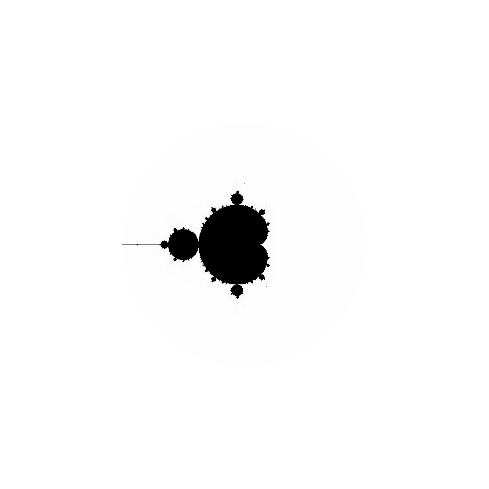

# Parallelized Mandelbrot Set Generator with OpenMP
### Introduction
A Mandlebrot set is defined to be the set of all complex numbers $\{c\}$ for which the generator function:

$f_c(z) = z^2 + c$

Stays bounded (i.e. does not diverege to $\pm \infty$). We start with a value of $z=0$ and iteratively evaluate $f_c$ as follows:

$[f_c(0), f_c(f_c(0)), f_c(f_c(f_c(0))),\dots]$

### Defining Divergence
Traditionally, divergence is defined by a threshold of the magnitude of the current element in the sequence. For example, if we choose a threshold of $f_{max} = 10$, then the sequence diverges at the $i^{th}$ iteration if $|f_c(i)| > f_{max} = 10$.

### Methods
Approach A: Fine-grained parallelization of Mandelbrot generator
Approach B: Generate multiple frames of generator at different "zooms" to create movie, assign different threads for different frames

Generated figure:

